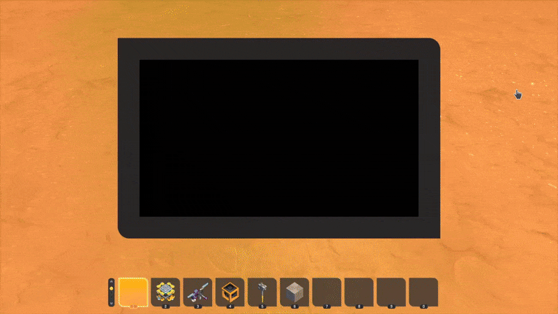

---

<h1 align="center">VeraDev</h1>

I'm a programmer and a Reverse Engineer. I create mods, software, tools, websites and more. I absolutely adore C++ & Lua as they are my favourite's, C++ being most favourite. All of my projects are designed to be quality and performant.

    
    

### 🛠 What i use.

